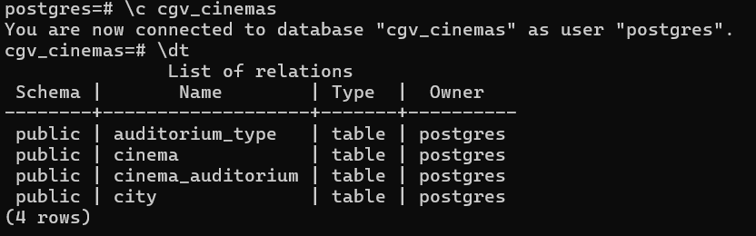
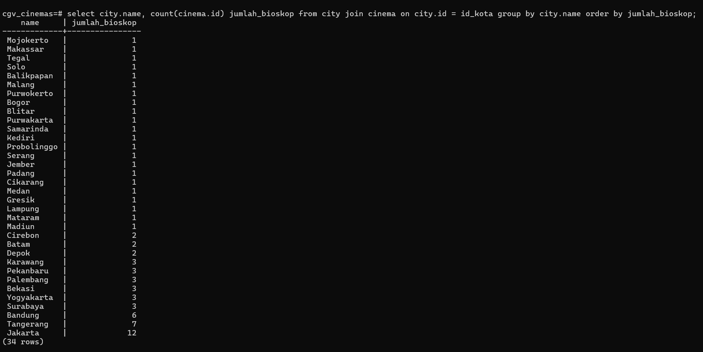

<h1 align="center">
  <br>
  Seleksi Warga Basdat 2025 <br>
  ETL Project
  <br>
  <br>
</h1>

## Data Bioskop CGV

### Author
* **Muhammad Aymar Barkhaya**
* **18223051**

---

### 2. Deskripsi
Proyek ini merupakan bagian dari seleksi asisten Laboratorium Basis Data 2025. Tujuannya adalah untuk melakukan proses **ETL (Extract, Transform, Load)** pada data bioskop CGV di Indonesia. Data yang diambil mencakup informasi kota, bioskop, dan jenis-jenis auditorium yang tersedia di setiap bioskop. Proses ini dilakukan untuk menguji kemampuan dalam _data scraping_, perancangan _database_, dan implementasi skema relasional ke dalam RDBMS. Pemilihan topik ini didasari kesukaan saya terhadap menonton bioskop, salah satunya di CGV Indonesia. CGV sendiri merupakan salah satu jaringan bioskop terbesar di Indonesia yang memiliki banyak bioskop di puluhan kota di Indonesia sehingga saya tertarik untuk mencari tahu data lengkapnya. Selain itu saya juga terinspirasi dari database pagila yang menemani matkul basdat kemarin:v

---

### 3. Cara Menggunakan Scraper dan Hasil Output
Proyek ini menggunakan bahasa pemrograman **Python** dengan library **Selenium** untuk melakukan _web scraping_. Hal ini diperlukan karena data bioskop CGV dimuat secara dinamis menggunakan JavaScript.

#### Requirements
* Python 3.x terinstal.
* `chromedriver` yang sesuai dengan versi Google Chrome.
* Library Python yang diperlukan: `selenium` dan `psycopg2`. Instalasi dapat dilakukan dengan `pip install -r requirements.txt`.

#### Cara Menjalankan
1.  Pastikan `chromedriver` berada di PATH sistem.
2.  Jalankan skrip `scraper.py` dari folder `src`:
    ```bash
    python src/scraper.py
    ```
3.  Tunggu hingga proses scraping selesai. Skrip akan menutup browser secara otomatis.

#### Output
Setelah skrip selesai, tiga file JSON akan dihasilkan di folder `Data Scraping/data/`:
* `city.json`
* `cinema.json`
* `auditorium.json`

---

### 4. Penjelasan Struktur File JSON
Data dari _scraper_ dipisahkan ke dalam tiga file JSON untuk menghindari redundansi dan mempermudah proses _data loading_. Hubungan antar entitas dipertahankan dengan menggunakan **Foreign Key (FK)**.

* `city.json`: Berisi daftar semua kota.
    * `CityID` (Primary Key)
    * `CityName`

* `auditorium.json`: Berisi daftar jenis-jenis auditorium yang unik.
    * `id` (Primary Key)
    * `name`

* `cinema.json`: Berisi daftar bioskop. Setiap bioskop memiliki _Foreign Key_ (`CityID`) yang merujuk ke kota, serta daftar jenis auditorium (`auditoriumTypes`).
    * `CinemaID` (Primary Key)
    * `CinemaName`
    * `CinemaAddress`
    * `CityID` (Foreign Key)
    * `auditoriumTypes` (List of strings)

---

### 5. Struktur ERD dan Diagram Relasional

ERD di atas adalah model konseptual yang menggambarkan hubungan antar entitas. Relasi "Berada di" antara `City` dan `Cinema` menunjukkan hubungan **one-to-many**, sedangkan relasi "Terdiri dari" antara `Cinema` dan `AuditoriumType` menunjukkan hubungan **many-to-many**.


Diagram di atas adalah model relasional yang telah diimplementasikan di RDBMS.

---

### 6. Proses Translasi ERD ke Diagram Relasional
Proses translasi dari ERD ke diagram relasional dilakukan dengan beberapa langkah:
1.  **Entitas menjadi Tabel**: Setiap entitas di ERD (`City`, `Cinema`, `AuditoriumType`) diterjemahkan menjadi tabel di skema relasional.
2.  **Membuat Foreign Key**: Relasi one-to-many (`City` dan `Cinema`) diimplementasikan dengan menambahkan `CityID` sebagai _Foreign Key_ di tabel `Cinema`.
4.  **Membuat Tabel Perantara (Junction Table)**: Relasi many-to-many (`Cinema` dan `AuditoriumType`) dipecah menjadi dua relasi melalui tabel perantara `CinemaAuditorium`.

---

### 7. _Screenshots_
Berikut adalah tangkapan layar yang menunjukkan implementasi _database_ dan hasil kueri di **PostgreSQL CLI**.








---

### 8. Referensi
* **Source Webpage**: [https://www.cgv.id/](https://www.cgv.id/)
* **Library Python**: `selenium`, `json`, `psycopg2`
* **Database**: PostgreSQL
* **Tool Scraping**: Selenium WebDriver
* **Tool Database**: psql
* **Youtube Tutorial**: https://youtube.com/playlist?list=PLzMcBGfZo4-n40rB1XaJ0ak1bemvlqumQ&si=gbUG1bVbkaMQZ1LK, https://youtu.be/qw--VYLpxG4?si=OD1K6I9TnNs54Ojv, https://youtu.be/M2NzvnfS-hI?si=LKvQmu7kQrbbYiK4