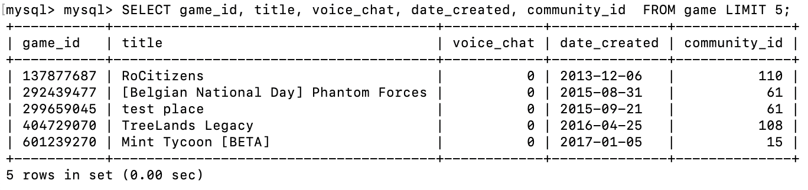
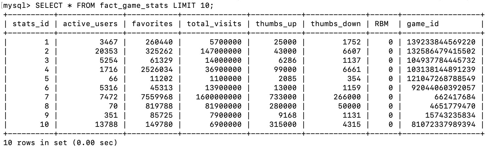
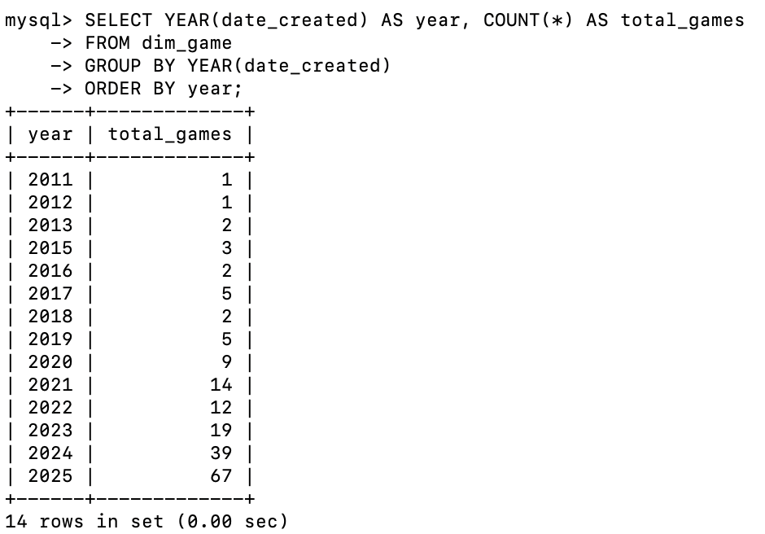

# **TUGAS SELEKSI 1 - BASIS DATA**  

## **Author**  
- **Nama**: Aliya Husna Fayyaza  
- **NIM**: 13523062  

---

## **Deskripsi Singkat**  
program ini melakukan ***web scraping*** data game Roblox menggunakan **Selenium** untuk kemudian diproses menjadi ***database*** berbasis **MySQL**. Data yang diambil dari web mencakup informasi detail game, komunitas game, dan kreator.  

**Alasan memilih topik**:  
Roblox memiliki game-game yang dinamis, dengan data yang kaya untuk dianalisis. Topik ini dipilih karena:  
1. Data dapat diupdate secara berkala melalui otomatisasi (cron job).  
2. Bisa dianalisis untuk melihat tren game, komunitas aktif, dan pengaruh kreator karena datanya akan berubah seiring berjalannya waktu  
3. Topik sejalan dengan kegemaran penulis

---

## **Cara Menggunakan Scraper & Output**  

### **Cara Menjalankan Script Scraper**
```bash
python scrape.py
```
### **Output Scraping**
Scraper menghasilkan 3 file JSON di folder:
```bash
Data Scraping/data/raw/
│── game.json
│── community.json
└── creator.json
```
### **Preprocessing**
Setelahnya, 3 file JSON hasil *scraping* diproses lebih lanjut dengan menjalankan:
```bash
python preprocess.py
```
Hasil *preprocessing* akan disimpan di folder:
```bash
Data Scraping/data/preprocessed/
│── game_preprocessed.json
│── community_preprocessed.json
│── genre_preprocessed.json
│── maturity_preprocessed.json
│── server_preprocessed.json
└── creator_preprocessed.json
```
### **Storing**
Terakhir, data dari 6 file JSON dimasukkan ke dalam *database* berbasis MySQL dengan menjalankan:
```bash
python storing.py
```
note: disesuaikan ingin menyimpan ke *database* (melalui folder Data Storing) atau *data warehouse* (melalui folder Data Warehouse)

## **Struktur File JSON**  
Berikut adalah contoh entry dari tiap file JSON hasil *scraping*:
### game.json
File JSON ini menyimpan data utama dari game-game yang di-*scraping*.
```bash
[
  {
    "Date": "2025-07-24",
    "Active Users": 13788,
    "Favorites": 149780,
    "Total Visits": 6900000,
    "Date Created": "2025-05-21",
    "Last Updated": "2025-07-24",
    "Server Size": 30,
    "Genre": "Sports",
    "Title": "[RELEASE] Tennis Zero",
    "Community": "Tennis Fans",
    "Maturity": "Minimal",
    "Thumbs Up": 315000,
    "Thumbs Down": 4315,
    "gameID": "81072337989394",
    "Category": "Most Engaging",
    "URL": "https://www.roblox.com/games/81072337989394/RELEASE-Tennis-Zero"
  }
]
```
### community.json
File JSON ini menyimpan community yang membuat game-game yang di-*scraping*.
```bash
[
  {
    "Community Name": "studio arsenic",
    "Members": "70K+",
    "Creator Name": "laplace"
  }
]
```
### creator.json
File JSON ini menyimpan creator yang membuat community yang membuat game-game yang di-*scraping*.
```bash
[
  {
    "Creator Name": "laplace",
    "Friends": 100,
    "Followers": 5000,
    "Following": 50
  }
]
```

## **Struktur ERD dan Diagram Relasional**  
## **1. Database**
### **ERD**
Entity
1. Creator: memiliki creator_id sebagai *primary key*
2. Monetization_Level: memiliki level_id sebagai *primary key*
3. Community: memiliki community_id sebagai *primary key*
4. Maturity: memiliki maturity_id sebagai *primary key*
5. Game: memiliki game_id sebagai *primary key*
6. Statistics: memiliki date sebagai diskriminator
7. Server: memiliki server_id sebagai *primary key*
8. Genre:  memiliki genre_id sebagai *primary key*

Relationship
1. Creator is Monetization_Level: Seorang Creator pasti memiliki satu Monetization Level namun sebuah level bisa dimiliki banyak Creator (many-to-one)
2. Creator creates Community: Seorang Creator bisa membuat beberapa Community namun suatu Community pasti dibuat oleh satu Creator (one-to-many)
3. Community owns Game: Sebuah Community bisa membuat banyak Game namun suatu Game pasti dibuat oleh satu Community (one-to-many)
4. Game has Server: Sebuah game maksimal memiliki 1 server (mungkin tidak memiliki untuk yang belum di-develop) dan suatu Server pasti dimiliki oleh satu Game (one-to-one)
5. Game categorized as Maturity: Sebuah Game memiliki satu Maturity namun satu Maturity bisa dimiliki oleh beberapa Game (many-to-one)
6. Game has Statistics: Sebuah Game bisa memiliki banyak Statistics namun satu Statistics pasti hanya dimiliki oleh satu Game (one-to-many). Dalam relasi ini, Statistics adalah weak entity karena hanya unik jika diskriminatornya (date) dikombinasikan dengan game_id sebagai primary key dari strong entity.
7. Game categorized as Genre: Sebuah Game memiliki satu Genre namun satu Genre bisa dimiliki oleh beberapa Game (many-to-one)
### **Diagram Relasional**
1. Creator: Memiliki creator_id sebagai *primary key* dan level_id sebagai *foreign key* yang merujuk pada level_id dari tabel Monetization_Level
2. Monetization_Level: Memiliki level_id sebagai *primary key*
3. Community: Memiliki community_id sebagai *primary key* dan crator_id sebagai *foreign key* yang merujuk pada creator_id dari tabel Creator
4. Maturity: Memiliki maturity_id sebagai *primary key*
5. Game: Memiliki game_id sebagai *primary key*, community_id sebagai *foreign key* yang merujuk pada community_id dari tabel Community, dan maturity_id sebagai *foreign key* yang merujuk pada maturity_id dari tabel Maturity
6. Server: Memiliki server_id sebagai *primary key*
7. Genre: Memiliki genre_id sebagai *primary key*
8. Statistics: Memiliki game_id sebagai *primary key* dan *foreign key* yang merujuk dari game_id pada tabel Game dan date sebagai *primary key*

## **2. Data Warehouse**
### **ERD**
Entity
1. fact_game_stats: Memiliki stats_id sebagai *primary key* (berisi statistik game yang akan berubah seiring berjalannya waktu)
2. dim_date: Memiliki date sebagai *primary key*(berguna untuk menyimpan semua tanggal agar analisis terhadap perkembangan statistik game terhadap waktu bisa dilakukan secara lebih mudah)
3. dim_game: Memiliki game_id sebagai *primary key* (berisi statistik game yang tidak akan berubah terhadap waktu/tidak ingin dianalisis perubahannya terhadap waktu)
4. dim_country: Memiliki country_id sebagai *primary key*
5. dim_community: Memiliki community_id sebagai *primary key*
6. dim_genre: Memiliki genre_id sebagai *primary key*

Relationship
1. dim_date when fact_game_stats: Pada suatu tanggal, bisa direkam beberapa statistik, namun suatu statistik hanya direkam pada satu tanggal (one-to-many)
2. fact_game_stats has dim_game: Suatu Game bisa memiliki banyak statistik namun suatu statistik hanya tentang satu Game (many-to-one)
3. dim_game played in dim_country: Suatu Game bisa dimainkan di banyak negara dan pemain-pemain di suatu negara bisa memainkan banyak Game (many-to-many)
4. dim_game owned by dim_community: Suatu Game dimiliki oleh suatu Community namun satu Community bisa memiliki banyak Game
5. dim_game categorized as dim_genre: Suatu Game hanya bisa memiliki satu Genre namun suatu Genre bisa dimiliki oleh banyak Game (many-to-one)
### **Diagram Relasional**
1. dim_date: Memiliki date sebagai *primary key* namun memiliki  *alternate key* seperti day, month, year (dibedakan date dan *alternate key* ini agar bisa membuat proses analisis data menjadi lebih fleksibel dan *query* analisis bisa dilakukan secara lebih cepat, terutama jika jumlah datanya sudah sangat banyak)
2. fact_game_stats: Memiliki stats_id sebagai *primary key*, date sebagai *foreign key* yang merujuk pada date dari tabel dim_date, dan game_id sebagai *foreign key* yang merujuk dari game_id pada tabel dim_game
3. dim_genre: Memiliki genre_id sebagai *primary key*
4. dim_country: Memiliki country_id sebagai *primary key*
5. dim_community: Memiliki community_id sebagai *primary key*
6. dim_game: Memiliki game_id sebagai *primary key*, genre_id sebagai *foreign key* yang merujuk pada genre_id dari tabel dim_genre, dan community_id sebagai *foreign key* yang merujuk pada community_id pada tabel dim_community
7. dim_game_per_cpuntry: Memiliki game_id sebagai *primary key* dan *foreign key* yang merujuk pada game_id dari tabel dim_game serta country_id sebagai *primary key* dan *foreign key* yang merujuk pada country_id dari tabel dim_country

## **Translasi ERD menjadi Diagram Relasional**  
## **1. Database**
Tidak ada relasi many-to-many dalam ERD sehingga tiap *entity* pada ERD ditranslasikan menjadi satu tabel. Berikut adalah penjelasan mendetailnya untuk tabel-tabel yang mengalami penambahan kolom karena proses translasi,
1. Creator: ditambahkan kolom level_id sebagai *foreign key* dari sisi one karena adanya relasi many-to-one dengan Monetization_Level
2. Community: ditambahkan kolom creator_id sebagai *foreign key* dari sisi one karena adanya relasi many-to-one dengan Creator
3. Game: ditambahkan kolom community_id sebagai *foreign key* dari sisi one karena adanya relasi many-to-one dengan Community serta kolom maturity_id sebagai *foreign key* dari sisi one karena adanya relasi many-to-one dengan Maturity
4. Statistics: ditambahkan kolom game_id sebagai *foreign key* dari sisi one karena adanya relasi many-to-one dengan Game juga menjadi *primary key* karena Statistics merupakan weak entity sehingga membutuhkan *primary key* dari sisi strong entity-nya agar didapatkan *primary key* berupa gabungan game_id dan date

## **2. Data Warehouse**
Terdapat satu relasi many-to-many (antara dim_game dan dim_country) dalam ERD sehingga ada penambahan satu tabel yaitu dim_game_per_country yang memuat primary key dari kedua tabel terkait. Selanjutnya, berikut adalah penjelasan mendetailnya untuk tabel-tabel yang mengalami penambahan kolom karena proses translasi,
1. fact_game_stats: ditambahkan kolom date sebagai *foreign key* dari sisi one karena adanya relasi many-to-one dengan dim_date serta kolom game_id sebagai *foreign key* dari sisi one karena adanya relasi many-to-one dengan dim_game
2. dim_game: ditambahkan kolom genre_id sebagai *foreign key* dari sisi one karena adanya relasi many-to-one dengan dim_genre serta kolom community_id dari sisi one karena adanya relasi many-to-one dengan dim_community

## **Beberapa *screenshot* dari Program** 
Berikut beberapa tangkapan layar hasil *query* dari *database* program:





## **Automated Scheduling** 
### **Cara Menjalankan Program Secara Otomatis**
Berikut adalah cara menjalankan program secara otomatis dan terjadwal di macOS/Linux:
1. Buka crontab editor
``bash
crontab -e
``
2. Tambahkan baris berikut untuk menjalankan program secara terjadwal (bisa disesuaikan, baris di bawah ini akan membuat program dijalankan pukul 08.00 tiap harinya)
``bash
0 8 * * * /usr/bin/python3 /path/ke/project/Data\ Scraping/src/automated.py
``
3. Simpan dan keluar dari crontab
### **Timestamp Ekstraksi**
Berikut adalah log timestamp ekstraksi *batch* pertama, kedua, dan ketiga:
[2025-08-08 10:08:41] Automated pipeline done.
[2025-08-08 11:25:23] Automated pipeline done.
[2025-08-08 12:24:59] Automated pipeline done.
Note: penulis menyesuaikan penjadwalan agar mempercepat proses ekstraksi ketiga *batch* sebagai penanda bahwa *automated scheduling* bisa dijalankan.

## **Referensi** 
### **Library yang digunakan**
Program ini menggunakan beberapa *library* seperti selenium dan chromedriver untuk *web scraping*, mysql-connector-python untuk menyambungkan python ke MySQL.
### **Situs**
*Web scraping* dilakukan terhadap *website* https://www.roblox.com/charts
### **Tools**
Program ini membutuhkan beberapa *tools* agar bisa dijalankan seperti Python 3.x (+ venv untuk python homebrew macOS), MySQL, serta Cron (untuk automated scheduling macOS)