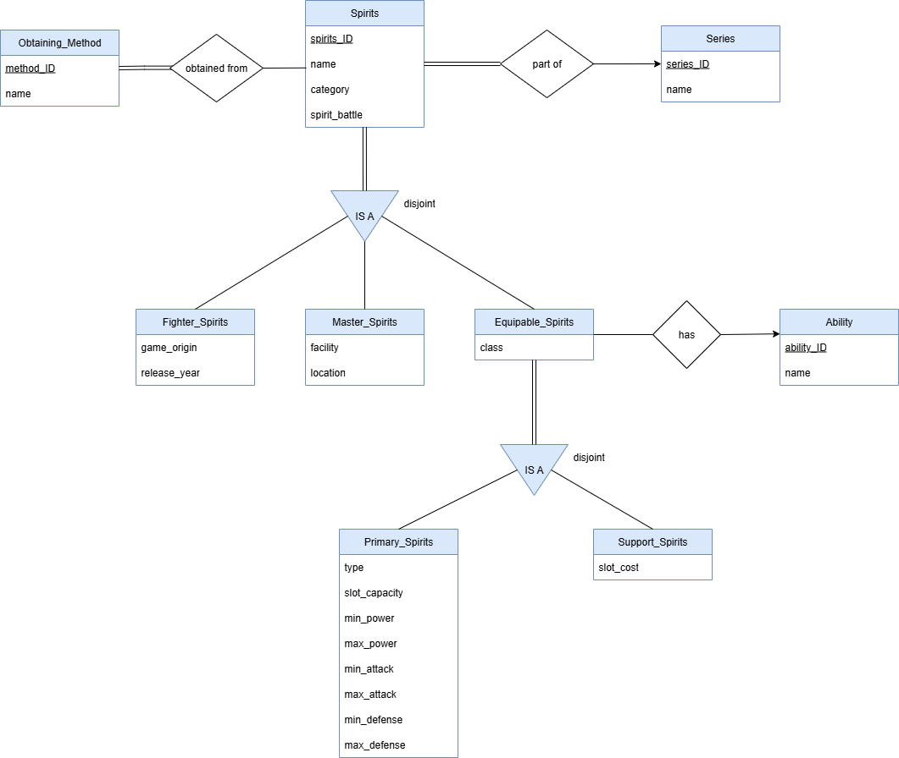

# ETL Project Seleksi 1 Basdat - Super Smash Bros. Ultimate Spirits

## 👤 Author
- **Nama**: Ahmad Evander Ruizhi Xavier
- **NIM**: 18223064

---

## 📌 Deskripsi Proyek
Proyek ini bertujuan untuk melakukan *web scraping* terhadap data *Spirits* dari game **Super Smash Bros. Ultimate**, kemudian menyimpannya dalam format terstruktur (JSON) dan memasukkannya ke dalam **Relational Database Management System (RDBMS)** menggunakan PostgreSQL. Spirits pada game Super Smash Bros. Ultimate merupakan komponen penting dalam game yang memuat seluruh karakter (baik yang bisa dimainkan maupun yang hanya menjadi pendukung) dari berbagai serial yang terdapat dalam game.

Topik ini dipilih karena author memiliki pengetahuan yang cukup dalam mengenai informasi game dan struktur data spirits yang cukup kompleks. Selain itu, web refrensi menampilkan data yang tersusun dengan kurang rapi dan tidak konsisten sehingga cocok untuk dijadikan proyek ETL.

---

## 🕹️ Cara Menggunakan Scraper dan Output-nya
1. Clone atau unduh repository ini
2. Buka terminal dari direktori:  
   ```bash
   ../Data Scraping/src/
3. Jalankan program dengan perintah berikut (atau disesuaikan dengan virtual environment yang digunakan):
    ```bash
    python scraping.py
4. Seluruh file JSON yang diperlukan akan didapat dan disimpan pada direktori yang sama. File output yang dihasilkan adalah:
    - ability.json
    - equipable_spirits.json
    - obtaining_method.json
    - primary_spirits.json
    - series.json
    - spirits_obtain.json
    - spirits.json
    - support_spirits.json
5. Seluruh file JSON output dipindahkan ke direktori:
   ```bash
   ../Data Scraping/data/
6. Pindah ke direktori:
   ```bash
   ../Data Storing/src/
7. Jalankan program untuk melakukan storing data ke RDBMS. Pastikan RDBMS menggunakan parameter global yang tertera pada kode, dan seluruh tabel yang diperlukan sudah dibuat:
    ```bash
    python storing.py
   
## Penjelasan Struktur File JSON yang Dihasilkan *Scraper*
- ability.json
   ```bash
    {
        "ability_id": 1, # id ability
        "name": "Stats up after Eating" # nama atau efek dari ability
    }

- equipable_spirits.json
  ```bash
  {
        "spirits_id": 18, # id spirits
        "class": 2, # class atau tingkat kelangkaan spirits (1 sampai 4)
        "ability_id": 1 # id ability
  }

- obtaining_method.json
   ```bash
    {
        "method_id": 1, # id method
        "name": "Spirit Board" # nama metode spirit tersebut didapatkan
    }

- primary_spirits.json
   ```bash
    {
        "spirits_id": 21, # id spirits
        "type": "Shield", # tipe spirits (Attack, Shield, Grab, atau Neutral)
        "slot_capacity": 1, # kapasitas total untuk support spirits yang bisa masuk
        "min_power": 2552, # akumulasi attack dan defense minimum
        "max_power": 7695, # akumulasi attack dan defense maksimum
        "min_attack": 510, # attack minimum
        "max_attack": 1539, # attack maximum
        "min_defense": 2042, # defense minimum
        "max_defense": 6156 # defense maksimum
    }

- series.json
   ```bash
    {
        "series_id": 1, # id series
        "name": "Super Mario Series" # nama series
    }
- spirits_obtain.json
   ```bash
    {
        "spirits_id": 3, # id spirits
        "method_id": 5 # id method
    }
- spirits.json
   ```bash
    {
        "spirits_id": 1, # id spirits
        "name": "Mario", # nama spirit yang bersangkutan
        "category": "Fighter", # kategori spirits (Fighter, Master, Primary, atau Support)
        "spirit_battle": false, # boolean apakah terdapat pertarungan melawan spirit tersebut
        "series_id": 1 # id series
    }
- support_spirits.json
   ```bash
    {
        "spirits_id": 18, # id spirits
        "slot_cost": 1 # jumlah slot yang digunakan dalam memasuki primary spirits
    }

## Struktur ERD dan Diagram Relasional RDMS


## Referensi
https://www.ssbwiki.com/List_of_spirits_(complete_list)#cite_note-TnT-1
